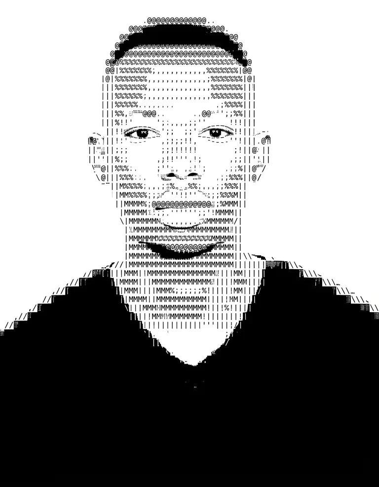

<!--
  ==================================================================
  GitHub Profile README (design card) — Guy Fleury Manirakiza (Manguy) / MGuyF
  Proudly Burundian 🇧🇮 — country code +257 · Full-Stack Developer
  Portfolio: https://manguy-portfolio.vercel.app/
  This file belongs to the MGuyF/MGuyF repository (ship it as README.md).
  ----------------------------------------------------------------
  LEFT  : assets/manguy_github_profile_photo.webp  (399px wide -> 512.3px tall)
  RIGHT : terminal panel, 24 lines, one single font size on every line
  ----------------------------------------------------------------
  HOW THE TWO COLUMNS KEEP THE SAME HEIGHT
  · GitHub renders <pre> at 85% of 16px = 13.6px, line-height 20px and
    vertical padding 16px, i.e. 24 x 20 + 2 x 16 = 512px tall
  · the photo is 768x986 (ratio 1.2839), so 399px wide -> 512.3px tall
  · added a line?  width = (lines x 20 + 32) / 1.2839
  ----------------------------------------------------------------
  TWO GITHUB GOTCHAS (both handled below)
  1. GitHub strips inline style, so the inline CSS only drives local previews;
     it mirrors GitHub's real metrics so the panel box is ~512px in both.
  2. a blank line inside <pre> closes the raw-HTML block on GitHub and the rest
     is rebuilt as 
/<h2> at 16px (mixed font sizes). Never add one here.
  ==================================================================
-->

  <table border="0" cellspacing="0" cellpadding="0" style="border-collapse: collapse; border: none; background-color: #ffffff; width: 100%;">
    <tr>
      <td width="40%" valign="middle" align="center" style="border: none; padding-right: 15px;">
        
      </td>
      <td width="60%" valign="top" style="border: none; text-align: left; padding-left: 10px;">
        <pre style="font-family: monospace; font-size: 13.6px; line-height: 20px; color: #111827; background: transparent; border: none; margin: 0; padding: 16px 0; white-space: pre;">
<b>manguy@github</b> ----------------------------------------------
<b>. Name:</b> ................ Guy Fleury Manirakiza (Manguy)
<b>. Origin:</b> .............. Burundian 🇧🇮 · country code +257
<b>. Based in:</b> ............ Nyamata, Rwanda 📍 · remote / on-site
<b>. Role:</b> ................ Full-Stack Developer · open to work
<b>. Education:</b> ........... B.S. Software Engineering (ULT, Burundi)
<b>. Languages:</b> ........... TypeScript, JavaScript, Python, PHP, C, SQL
<b>. Front-end:</b> ........... React, Next.js, Vue, Inertia, Tailwind
<b>. Back-end:</b> ............ Django, DRF, Laravel, REST &amp; GraphQL
<b>. Data &amp; Maps:</b> ......... PostgreSQL, PostGIS, GeoDjango, MapLibre
<b>. Tools:</b> ............... Git, GitHub Actions, Vercel, Render, Odoo 17
<b>. Portfolio:</b> ........... <a href="https://manguy-portfolio.vercel.app/" style="color: #0284c7; text-decoration: none;">manguy-portfolio.vercel.app</a>
<b>. Email:</b> ............... <a href="mailto:2000291gf@gmail.com" style="color: #0284c7; text-decoration: none;">2000291gf@gmail.com</a>
<b>. LinkedIn:</b> ............ <a href="https://www.linkedin.com/in/gfmanirakiza29-1-bdi/" style="color: #0284c7; text-decoration: none;">linkedin.com/in/gfmanirakiza29-1-bdi</a>
<b>. GitHub:</b> .............. <a href="https://github.com/MGuyF" style="color: #0284c7; text-decoration: none;">github.com/MGuyF</a>
------------------------------------------------------------
<b>. SOSGEOAID:</b> ........... <a href="https://sos-geo-aid.vercel.app/" style="color: #0284c7; text-decoration: none;">Aid geolocation · Next.js + PostGIS</a>
<b>. RefuLearn:</b> ........... <a href="https://refulearn.vercel.app/" style="color: #0284c7; text-decoration: none;">Refugee education platform</a> · <a href="https://github.com/MGuyF/RefuLearn" style="color: #0284c7; text-decoration: none;">code</a>
<b>. Bus Driver:</b> .......... <a href="https://bus-driver-full-stack.vercel.app/" style="color: #0284c7; text-decoration: none;">Drivers + tours admin</a> · <a href="https://github.com/MGuyF/Bus-Driver-FullStack" style="color: #0284c7; text-decoration: none;">code</a>
<b>. Blog:</b> ................ <a href="https://blog-laravue-demo-dbx4.onrender.com/" style="color: #0284c7; text-decoration: none;">Mini-blog · Laravel + Vue</a> · <a href="https://github.com/MGuyF/blog-laravue-demo" style="color: #0284c7; text-decoration: none;">code</a>
<b>. User Mgmt:</b> ........... <a href="https://user-management-assessment-green.vercel.app/" style="color: #0284c7; text-decoration: none;">React 19 + TS data table</a>
<b>. EBMS:</b> ................ <a href="https://github.com/MGuyF/odoo-obr-ebms-showcase" style="color: #0284c7; text-decoration: none;">Odoo 17 ↔ Burundi OBR eBM (code)</a>
<b>. Akiwacu:</b> ............. Vue + Laravel platform (private)
------------------------------------------------------------
        </pre>
      </td>
    </tr>
  </table>

---

  Built with passion by <b>Guy Fleury Manirakiza (Manguy)</b> · Amahoro from Burundi 🇧🇮

